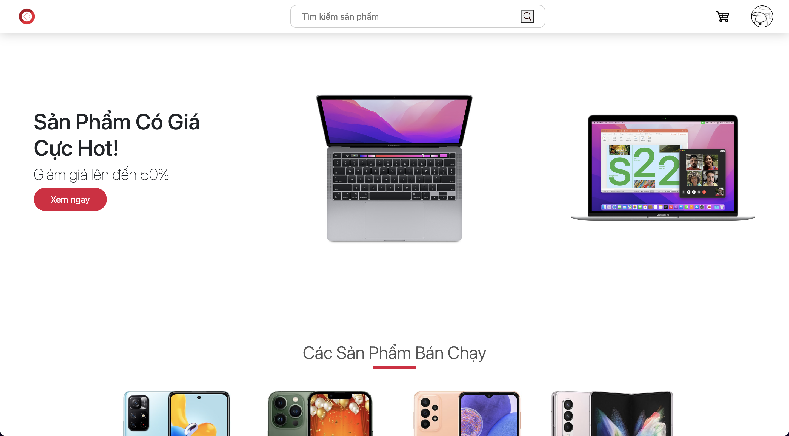
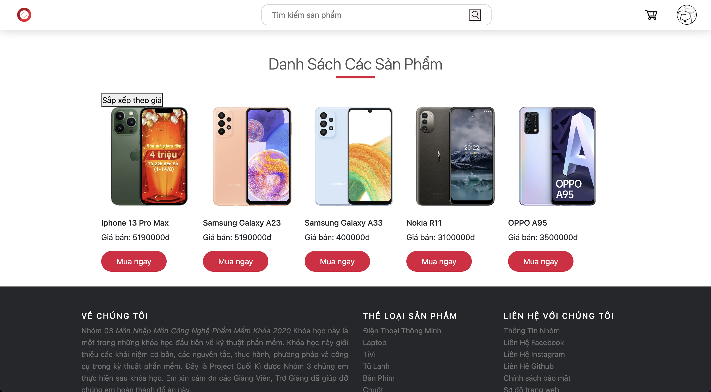
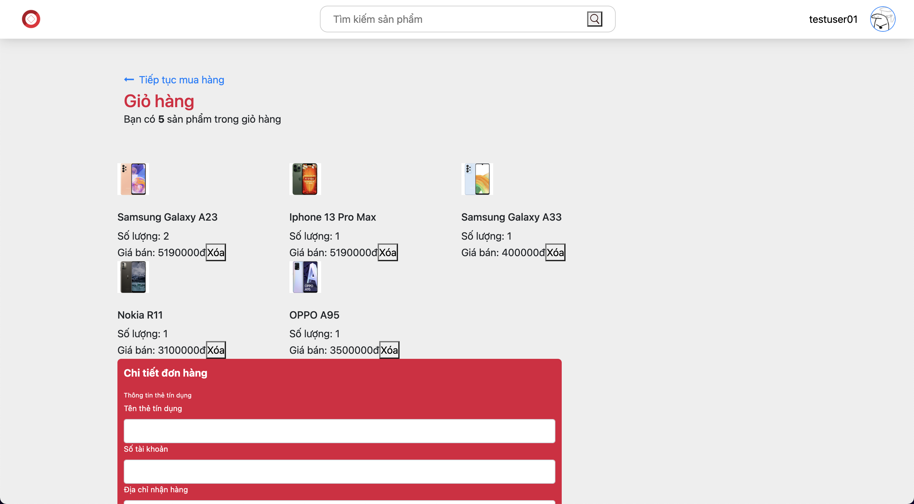
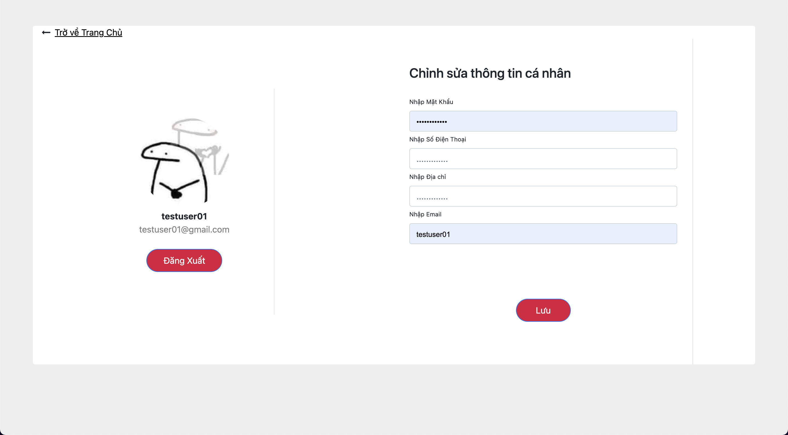

# TechStore Website

- Made with Express Framework of Node.js web application
- Made with JS/HTML/CSS for frontend
- The Project of **Introduction to Software Engineering**
- Scores: 8.5/10 :)
- Members of the Group 03:

  1. Nguyễn Thái Hiệp - Product Manager, Developer
  2. Đoàn Ánh Dương - Developer, Designer, Tester
  3. Lê Nguyễn Lan Vy - Developer, Business Analyst, Tester
  4. Dương Quang Bình - Developer, Designer, Tester
  5. Phùng Nghĩa Phúc - Developer, Designer, Tester

# Requirements

- Install [Node.js](https://nodejs.org/en/)
- Install MongoShell

# Development

```
% npm init
% npm install body-parser cookie-parser dotenv express jsonwebtoken mongodb mongoose multer pug
```

# Deployment

```
% node index.js
```

**Note: Your server default runs on <mark>PORT 3000</mark> and opens http://localhost:3000 to view it in the browser.**

# Overview

- HomePage
  
- ProductPage
  
- CheckoutPage
  
- UserInformationPage
  

Author: Nguyễn Thái Hiệp
